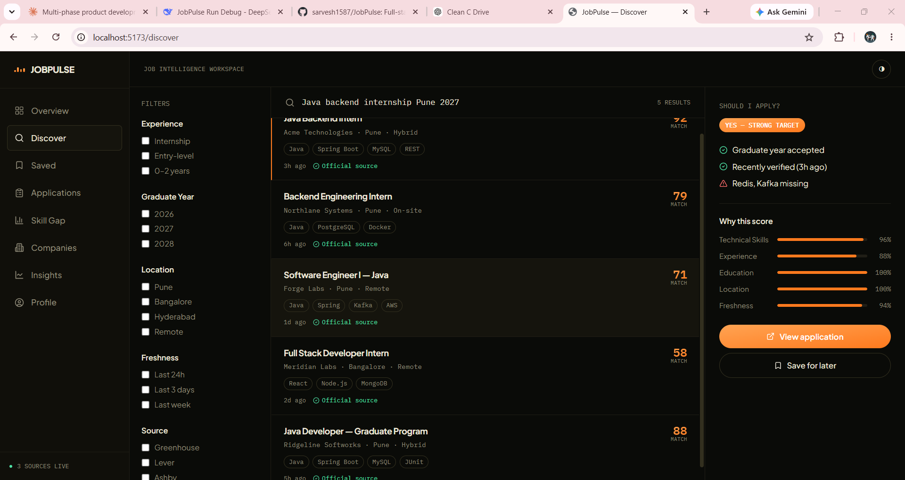
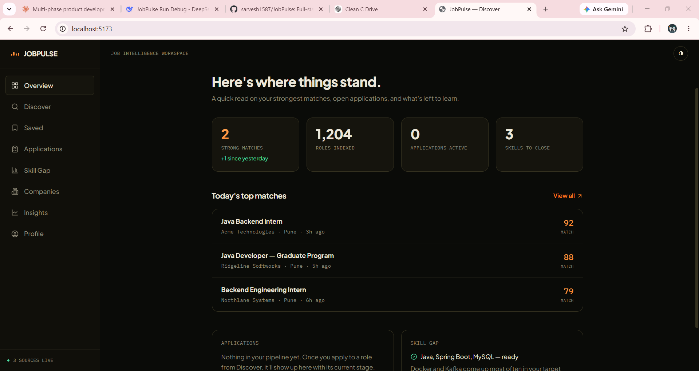
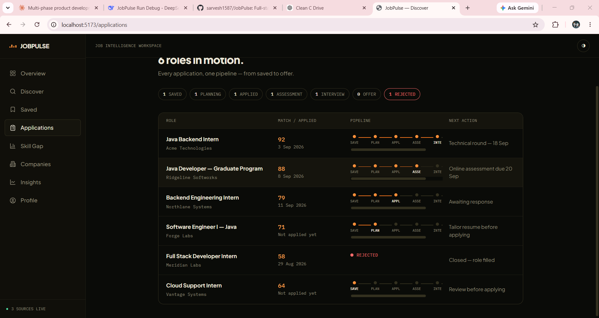
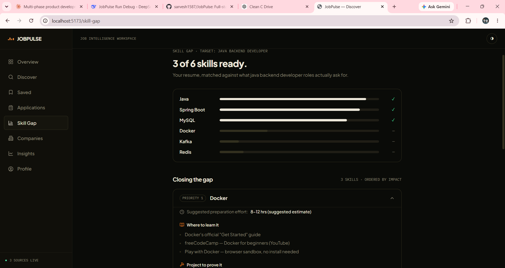

# JobPulse

**Stop searching. Start targeting.**

**Repo:** [github.com/sarvesh1587/JobPulse](https://github.com/sarvesh1587/JobPulse)
**Status:** In active development · **Last verified:** 2026-09-23
**Stack:** Java 21 · Spring Boot 3.3 · PostgreSQL · Redis · FastAPI · React 18 · TypeScript

Job intelligence for students and early-career developers. Instead of showing thousands of listings, JobPulse scores every job against your actual profile — skills, experience, education, location, freshness — and explains _why_, so the question stops being "what jobs exist" and starts being "which ones are actually worth my time."

This is a portfolio project, built in phases and documented honestly at every stage — what's real, what's a placeholder, and what's still missing. See **Status** below before assuming any piece is production-ready.

---

## Screenshots









---

## Repo layout

Built as four separate pieces, unified into one repo:

```
jobpulse/
├── landing/          # marketing/landing page (static HTML)
├── frontend/         # React app — Overview, Discover, Applications, Skill Gap
├── backend/          # Spring Boot API — auth, jobs, matching, ingestion
├── ai-service/       # FastAPI — skill extraction, resume parsing, semantic match
└── README.md         # this file
```

Each subfolder has its own README with setup instructions specific to that piece — this file is the map, not a replacement for those.

---

## Tech stack

| Layer        | Stack                                                                                                              |
| ------------ | ------------------------------------------------------------------------------------------------------------------ |
| Landing page | Static HTML/CSS/JS, no build step                                                                                  |
| Frontend     | React 18, TypeScript, Vite, Tailwind CSS, React Router, lucide-react                                               |
| Backend      | Java 21, Spring Boot 3.3, Spring Security (JWT), Spring Data JPA, PostgreSQL, Flyway, Redis (client wired, unused) |
| AI service   | Python 3.12, FastAPI, spaCy, sentence-transformers (with TF-IDF/scikit-learn fallback)                             |
| Ingestion    | Greenhouse, Lever, and Ashby public job-board APIs — no auth, no scraping                                          |

---

## Status

Honesty over optics — this is what actually exists, not what the brief originally asked for. **Last verified: 2026-09-23.**

### ✅ Built, runs, verified

- **Backend** — compiles clean on Java 21, starts against real Postgres (Docker), Flyway applies V1 + V2 migrations, and `POST /api/auth/register` returns a valid JWT. The full chain Postgres → JPA → Flyway → Spring Security → JWT is proven working end to end.
- **AI service** — server starts via `uvicorn`, all endpoints respond, 8/8 pytest tests pass. `/health` reports the `sentence-transformers` backend active (not just the TF-IDF fallback).
- **Frontend** — builds clean (`npm run build` verified), runs on Vite dev server. Currently uses mock data.
- **Landing page** — full design system, interactive hero demo, dark/light theme, mobile nav.
- **Ingestion pipeline** — real adapters for Greenhouse / Lever / Ashby public APIs, fetch → validate → dedupe → upsert → verify, naive keyword-based skill tagging.
- **Matching engine** — deterministic, explainable scoring (skills / experience / education / location / freshness) with configurable weights. Never a bare number without a reason.

### ⚠️ Known issues

- **Flyway migration gap** — `V1__init_schema.sql` omits `created_at` and `updated_at` on 9 tables that all extend `BaseEntity`. Currently worked around with `spring.jpa.hibernate.ddl-auto=none`. A `V3__add_missing_base_entity_columns.sql` migration is in progress.
- **Backend test compilation** — `AuthServiceTest` fails to compile because Lombok `@Builder` on `User` cannot see the inherited `BaseEntity.id` field. Temporarily bypassed with `-Dmaven.test.skip=true`. Fix in progress.
- **Redis** — dependency and config exist, nothing uses it yet.
- **Admin role seeding** — the ingestion trigger endpoint checks for `role = ADMIN`, but nothing currently creates an admin user.

### ❌ Not built yet

- **Frontend ↔ backend wiring** — the React app doesn't call the Spring Boot API yet
- **Backend ↔ AI service wiring** — Java's `MatchingService` and `ResumeParsingService` still use local logic
- **Frontend pages**: Saved, Companies, Insights, Profile (stubs only)
- **Docker Compose doesn't cover the AI service or the frontend yet**

---

## Local setup

### Prerequisites

- **Java 21** (Temurin recommended)
- **Maven 3.9+**
- **Node 18+** — verified on Node 22
- **Python 3.11+** — verified on Python 3.12
- **Docker Desktop** — for Postgres + Redis

### 1. Infra (Postgres + Redis via Docker)

```bash
cd backend
docker compose up postgres redis -d
docker compose ps
```

### 2. Backend (Spring Boot)

```bash
cd backend
cp .env.example .env
# Edit .env and set JWT_SECRET to a long random string
```

Load `.env` into your shell, then run:

```bash
# Unix / Git Bash
export $(cat .env | xargs)

# Windows cmd
for /f "usebackq tokens=1,* delims==" %i in (".env") do set "%i=%j"
```

Then:

```bash
mvn clean compile
mvn spring-boot:run -Dmaven.test.skip=true
```

Success looks like `Started JobpulseApplication in X.XXX seconds` plus Flyway logging V1 and V2 migrations applied.

**Smoke test:**

```bash
curl -s -X POST http://localhost:8080/api/auth/register \
  -H "Content-Type: application/json" \
  -d '{"email":"test@example.com","password":"password123","fullName":"Test User"}'
```

Swagger UI: <http://localhost:8080/api/docs/ui>

### 3. AI service (FastAPI)

```bash
cd ai-service
python -m venv venv
# Windows: venv\Scripts\activate
source venv/bin/activate
pip install -r requirements.txt
python -m spacy download en_core_web_sm
uvicorn app.main:app --reload
```

**Health check:**

```bash
curl -s http://localhost:8000/health
```

Swagger UI: <http://localhost:8000/docs>

### 4. Frontend (Vite + React)

```bash
cd frontend
npm install
npm run dev
```

Opens on <http://localhost:5173>.

---

## What's next, in priority order

1. `V3__add_missing_base_entity_columns.sql` migration to fix the schema-validation gap; restore `ddl-auto=validate`
2. Fix `AuthServiceTest` compilation; get `mvn test` green
3. Wire the frontend to the backend (replace mock data with real API calls)
4. Wire `MatchingService` / `ResumeParsingService` (Java) to the AI service
5. Build the remaining frontend pages (Saved, Companies, Insights, Profile)
6. Redis caching for hot queries (popular searches, company pages)
7. Docker Compose covering all four services together

---

## License

Portfolio project — no license granted for reuse without permission.
