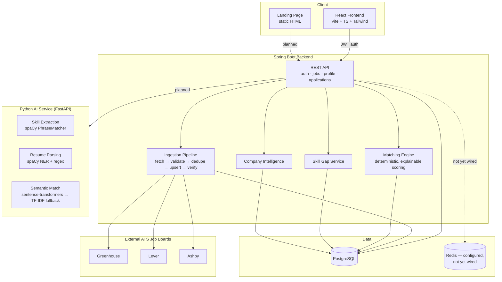
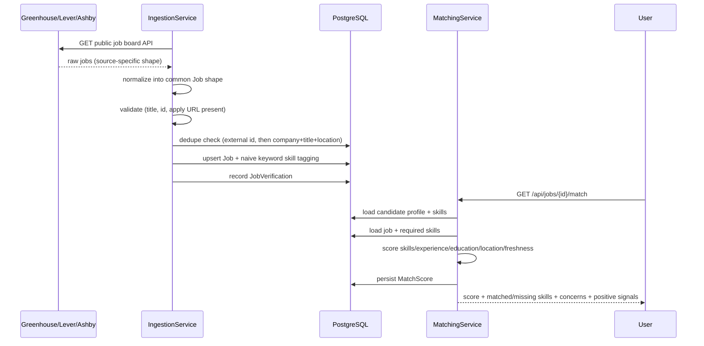

# JobPulse

**Stop searching. Start targeting.**

Job intelligence for students and early-career developers. Instead of
showing thousands of listings, JobPulse scores every job against your
actual profile — skills, experience, education, location, freshness — and
explains *why*, so the question stops being "what jobs exist" and starts
being "which ones are actually worth my time."

This is a portfolio project, built in phases and documented honestly at
every stage — what's real, what's a placeholder, and what's still missing.
See **Status** below before assuming any piece is production-ready.

---

## Suggested repo layout

This was built as four separate pieces. If you're assembling them into one
repo, this layout matches what each piece's own README assumes:

```
jobpulse/
├── landing/          # marketing/landing page (static HTML)
├── frontend/         # React app — Overview, Discover, Applications, Skill Gap
├── backend/          # Spring Boot API — auth, jobs, matching, ingestion
├── ai-service/       # FastAPI — skill extraction, resume parsing, semantic match
└── README.md         # this file
```

Each subfolder has its own README with setup instructions specific to that
piece — this file is the map, not a replacement for those.

---

## Architecture



Dotted lines mark connections that are designed but not implemented yet —
see Status.

### Data flow: from a raw listing to a match score



---

## Tech stack

| Layer | Stack |
|---|---|
| Landing page | Static HTML/CSS/JS, no build step |
| Frontend | React 18, TypeScript, Vite, Tailwind CSS, React Router, lucide-react |
| Backend | Java 21, Spring Boot 3.3, Spring Security (JWT), Spring Data JPA, PostgreSQL, Flyway, Redis (client wired, unused) |
| AI service | Python 3.12, FastAPI, spaCy, sentence-transformers (with TF-IDF/scikit-learn fallback) |
| Ingestion | Greenhouse, Lever, and Ashby public job-board APIs — no auth, no scraping |

---

## Status

Honesty over optics — this is what actually exists, not what the brief
originally asked for.

### ✅ Built and working
- **Landing page** — full design system, interactive hero demo, all
  sections from the brief, dark/light theme, mobile nav
- **Frontend app shell** — routing, sidebar, Overview / Discover /
  Applications / Skill Gap pages. Builds clean (`npm run build` verified).
  Runs entirely on mock data — **not wired to the backend yet**.
- **Backend core** — auth, job search/detail, profile, application
  tracker, resume upload (consent-gated), skill gap computation, company
  intelligence — full Flyway schema for every entity in scope
- **Ingestion pipeline** — real adapters for Greenhouse/Lever/Ashby's
  public APIs, fetch → validate → dedupe → upsert → verify, naive
  keyword-based skill tagging
- **Matching engine** — deterministic, explainable scoring
  (skills/experience/education/location/freshness) with configurable
  weights, never a bare number without a reason
- **AI service** — skill extraction and resume parsing (spaCy), semantic
  matching with automatic TF-IDF fallback when the transformer model isn't
  available. **This is the one component I actually ran and tested
  end-to-end** (server started, real HTTP requests, 8/8 pytest tests pass)

### ⚠️ Built but unverified
- **Backend compiles** — I wrote every line carefully, but the sandbox
  this was built in has no Maven Central access, so `mvn clean compile`
  has never actually been run against this code. **Run it yourself before
  trusting it.** If it fails, the fix is probably small — tell me the
  error.
- **sentence-transformers path in the AI service** — the code is written,
  but torch/sentence-transformers couldn't be installed in this sandbox
  (disk + no Hugging Face Hub access), so only the TF-IDF fallback has
  actually been exercised.

### ❌ Not built yet
- **Frontend ↔ backend wiring** — the React app doesn't call the Spring
  Boot API at all right now
- **Backend ↔ AI service wiring** — `ResumeParsingService` and
  `MatchingService` in Java still use their own naive logic; they don't
  call the FastAPI service
- **Frontend pages**: Saved, Companies, Insights, Profile (stubs only)
- **Redis caching** — dependency and config exist, nothing uses it
- **Admin-role seeding** — the ingestion trigger endpoint checks for
  `role = ADMIN`, but nothing creates one
- Docker Compose doesn't include the AI service yet (only Postgres, Redis,
  backend)

### Can this go on GitHub right now?
Yes. A documented, in-progress portfolio project is normal and expected —
this README's job is to make sure nobody (including future-you) mistakes
"in progress" for "broken" or "finished." Do run the backend build
yourself first so the repo isn't shipping an unverified claim as fact.

---

## Local setup (short version — see each subfolder's README for detail)

```bash
# 1. Infra
cd backend && docker compose up postgres redis -d

# 2. Backend
cd backend && cp .env.example .env   # fill in a real JWT_SECRET
mvn clean compile                     # verify it builds — do this first
mvn spring-boot:run

# 3. AI service (separate terminal)
cd ai-service
python -m venv venv && source venv/bin/activate
pip install -r requirements.txt
python -m spacy download en_core_web_sm
uvicorn app.main:app --reload

# 4. Frontend (separate terminal)
cd frontend
npm install
npm run dev
```

## What's next, in priority order

1. Verify the backend actually compiles and runs against real Postgres
2. Wire the frontend to the backend (replace mock data with real API calls)
3. Wire `MatchingService`/`ResumeParsingService` (Java) to the AI service
4. Build the remaining frontend pages (Saved, Companies, Insights, Profile)
5. Redis caching for hot queries (popular searches, company pages)
6. Docker Compose covering all four pieces together
